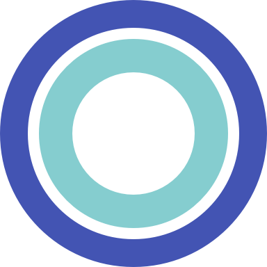

[](https://travis-ci.org/saltedge/sca-authenticator-ios)
[](https://img.shields.io/cocoapods/v/SaltedgeAuthenticatorSDK.svg?style=flat)
[](http://perso.crans.org/besson/LICENSE.html)
[](http://twitter.com/saltedge)

<br />
<p align="center">
  
  <h3 align="center">
    <a href="https://www.saltedge.com/products/strong_customer_authentication">
    Salt Edge Authenticator App - Strong Customer Authentication Solution
    </a>
  </h3>
  <p align="center">
    <br />
    <a href="https://github.com/saltedge/sca-identity-service-example/wiki"><strong>Explore our Wiki »</strong></a>
    <br />
    <br />
  </p>
</p>


# Salt Edge Authenticator iOS Client  

Salt Edge Authenticator iOS Client - is a mobile client of Authenticator API of Bank (Service Provider) System system that implements Strong Customer Authentication/Dynamic Linking process.  
The purpose of Authenticator iOS Client is to add possibility to authorize required actions for end-user.  

You can download mobile application:   
<a href='https://apps.apple.com/md/app/priora-authenticator/id1277625653'>
    
</a> 
  
## Source code

You can find related source code: 
* [Authenticator Identity Service](https://github.com/saltedge/sca-identity-service-example);
* [Authenticator Android app](https://github.com/saltedge/sca-authenticator-android).

## How it works

* [Authenticator iOS SDK readme](docs/SDK_README.md)
* [Authenticator iOS app workflow](docs/WORKFLOW.md)
* [Authenticator Identity Service Wiki](https://github.com/saltedge/sca-identity-service-example/wiki)
* [Authenticator Identity Service API](https://github.com/saltedge/sca-identity-service-example/blob/master/docs/IDENTITY_SERVICE_API.md)

## Prerequisites

* Xcode 10.2
* iOS 10.0+
* Swift 5+
* swiftlint
  ```bash
  brew install swiftlint
  ```
  
## SDK installation via [CocoaPods](https://cocoapods.org)
  
#### Add the pod to your `Podfile`
  
  ```ruby
  pod 'SEAuthenticator', '~> 1.0.2'
  ```
  
#### Import SDK into your app
  
  `import SEAuthenticator`

## How to build locally

You can install app from [Apple Appstore](https://apps.apple.com/md/app/priora-authenticator/id1277625653) 
or build from source code.

1. Fork this repository
1. Open terminal
1. Move to project directory `sca-authenticator-ios/Example`
1. Command in terminal: `bundle install` (To install all required gems)
1. Command in terminal: `pod install` (To install all required pods)
1. Open project's workspace file in Xcode (`Example/Authenticator.xcworkspace`)
1. Create `application.plist` configuration file using `application.example.plist`
1. If you have intent to use Firebase Crashlytics then generate `GoogleService-info.plist` and add it to project.
1. Build and run application on target device or simulator

## Contribute

In the spirit of [free software][free-sw], **everyone** is encouraged to help [improve this project](CONTRIBUTING.md).

* [Contributing Rules](CONTRIBUTING.md)  

[free-sw]: http://www.fsf.org/licensing/essays/free-sw.html

## Contact us

Feel free to [contact us](https://www.saltedge.com/pages/contact_support)

## License

**Salt Edge Authenticator (SCA solution) is multi-licensed, and can be used and distributed:**  
- under a GNU GPLv3 license for free (open source). See the [LICENSE](LICENSE.txt) file.
- under a proprietary (commercial) license, to be used in closed source applications. 

[More information about licenses](https://github.com/saltedge/sca-identity-service-example/wiki/Multi-license).  

**Additional permission under GNU GPL version 3 section 7**   
If you modify this Program, or any covered work, by linking or combining it with [THIRD PARTY LIBRARY](THIRD_PARTY_NOTICES.md) (or a modified version of that library), containing parts covered by the [TERMS OF LIBRARY's LICENSE](THIRD_PARTY_NOTICES.md), the licensors of this Program grant you additional permission to convey the resulting work. {Corresponding Source for a non-source form of such a combination shall include the source code for the parts of [LIBRARY](THIRD_PARTY_NOTICES.md) used as well as that of the covered work.}  
  
**AppStore Legal Notice**  
[APP_STORE_NOTICE](docs/APP_STORE_NOTICE.md)  

___
Copyright © 2019 Salt Edge. https://www.saltedge.com 
